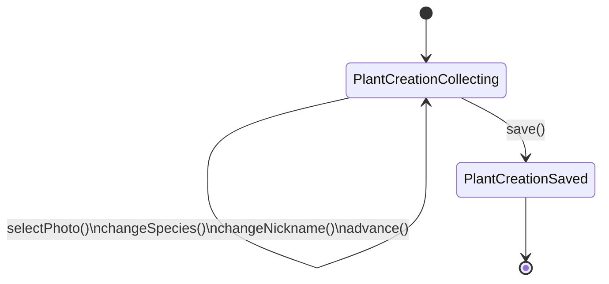
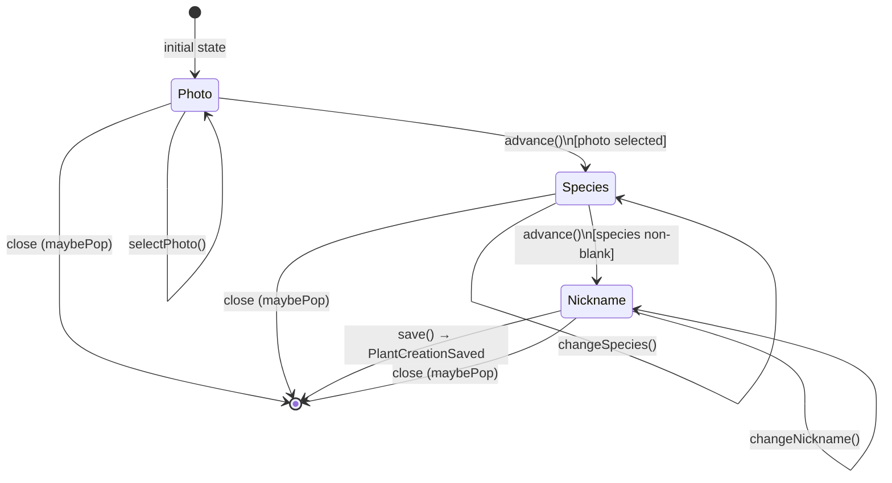
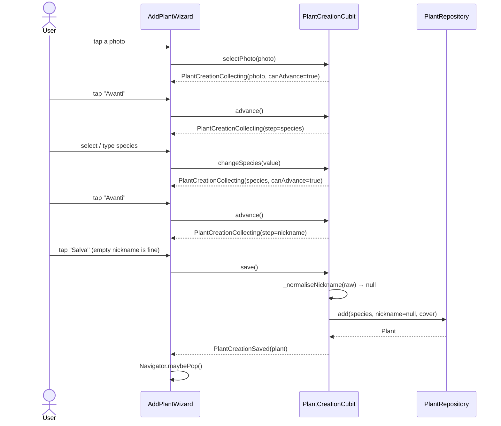
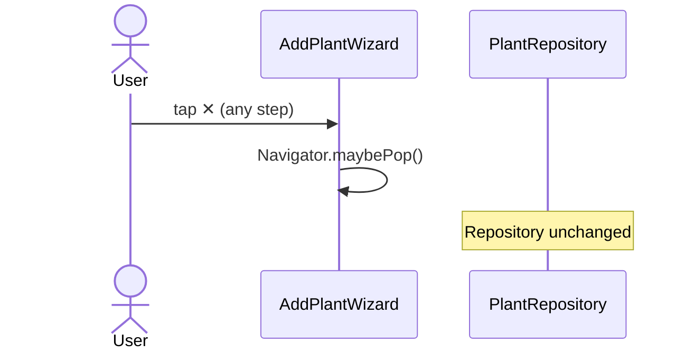
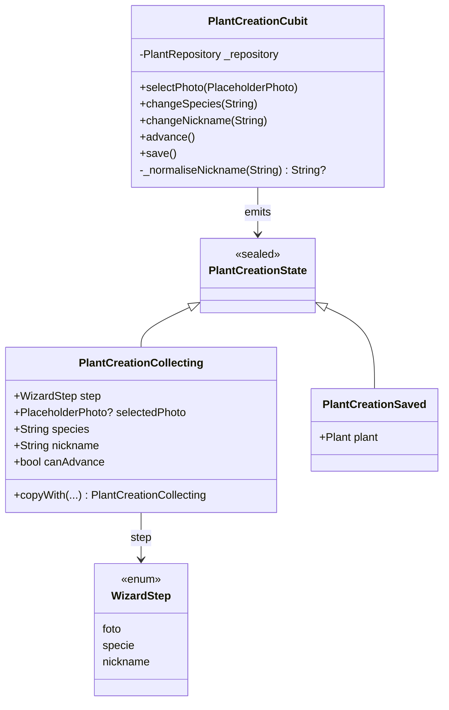
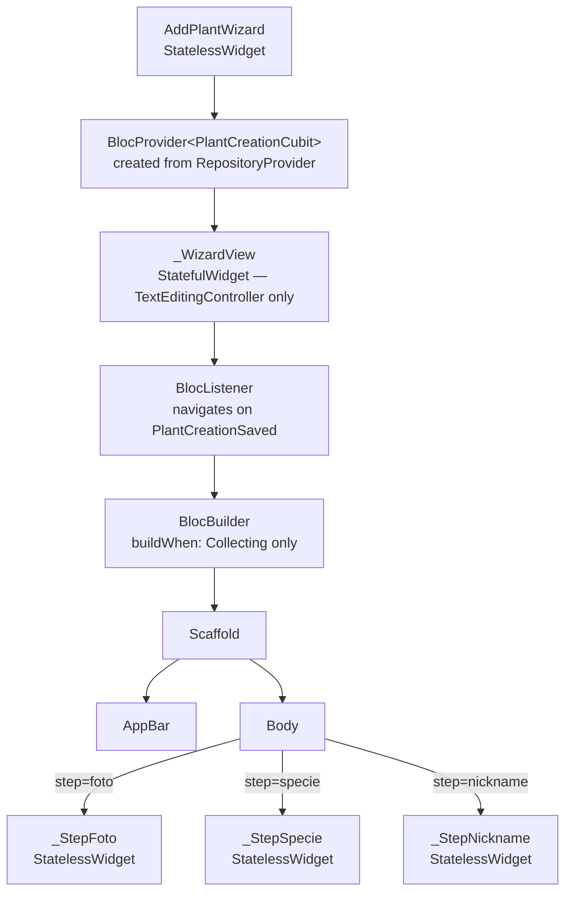

# Feature: Add Plant (add_plant)

A 3-step wizard that lets the user create a new plant by choosing a photo, species, and nickname. All business logic resides in `PlantCreationCubit`; widgets are stateless (except for a thin wrapper that manages `TextEditingController` lifecycle).

**Files:** `lib/features/add_plant/`

---

## Cubit state machine

---

## Wizard steps

---

## Sequence diagram — full happy path

---

## Sequence diagram — close without saving

---

## Class diagram

---

## Widget tree

---

## Nickname validation rules

| Condition | Behaviour |
|-----------|-----------|
| Empty / whitespace-only | `null` → repository generates default nickname |
| Length > 100 characters | `ArgumentError` |
| Contains control characters (U+0000–U+001F, U+007F) | `ArgumentError` |
| Valid non-empty | Trimmed and used as-is |

Error messages never include the user-supplied value.

---

## `canAdvance` per step

| Step | Condition for `canAdvance = true` |
|------|------------------------------------|
| `foto` | `selectedPhoto != null` |
| `specie` | `species.trim().isNotEmpty` |
| `nickname` | always `true` |

---

## Test coverage

### `test/features/add_plant/plant_creation_cubit_test.dart` (14 tests)

| Group | Behaviours |
|-------|------------|
| Initial state | Step = foto, no photo, empty species |
| Step Photo | canAdvance false → true, advance no-op without photo, advance proceeds |
| Step Species | canAdvance false → true, whitespace doesn't count, advance proceeds |
| Step Nickname | canAdvance always true |
| save | Emits Saved, plant in repo, default nickname, trimmed nickname, validation errors |

### `test/features/add_plant/add_plant_wizard_test.dart` (11 widget tests)

| Scenario | Behaviour |
|----------|-----------|
| Step Photo | Grid visible, Next disabled, tap photo enables and advances |
| Step Species | Next disabled, typing enables, tapping from list enables |
| Step Nickname | Save always enabled |
| Close | No plant in repo |
| Happy path | Plant saved with correct species |
