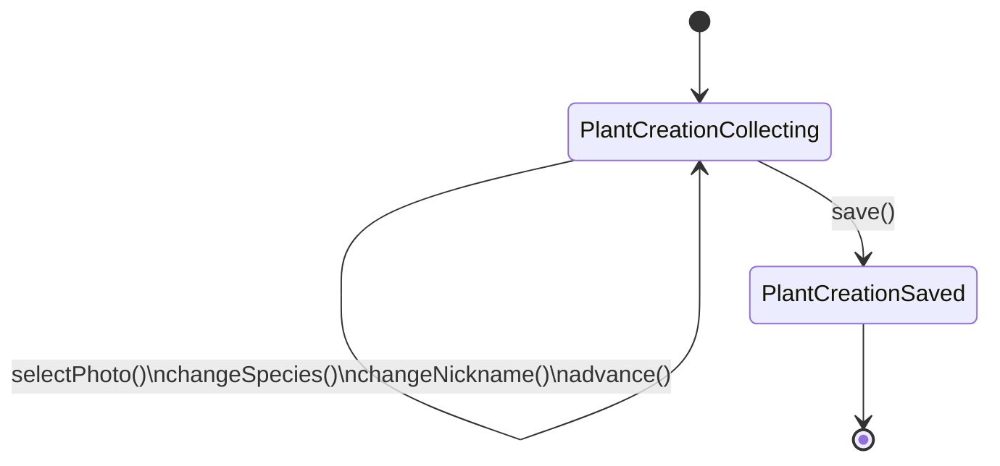
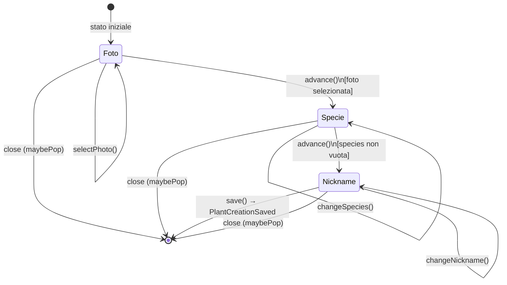
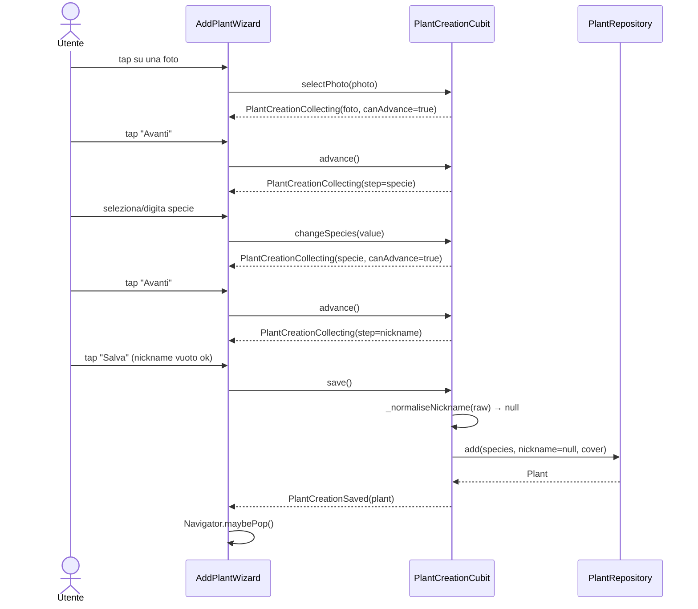
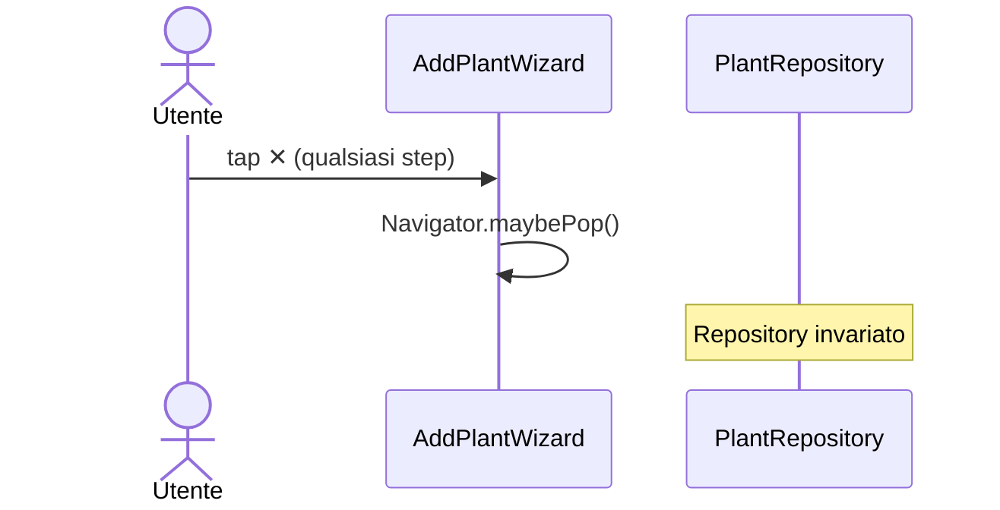
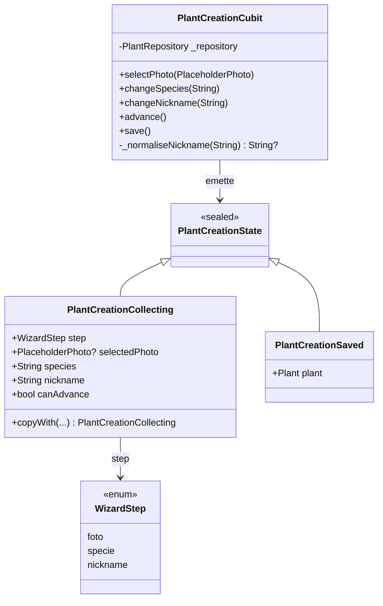
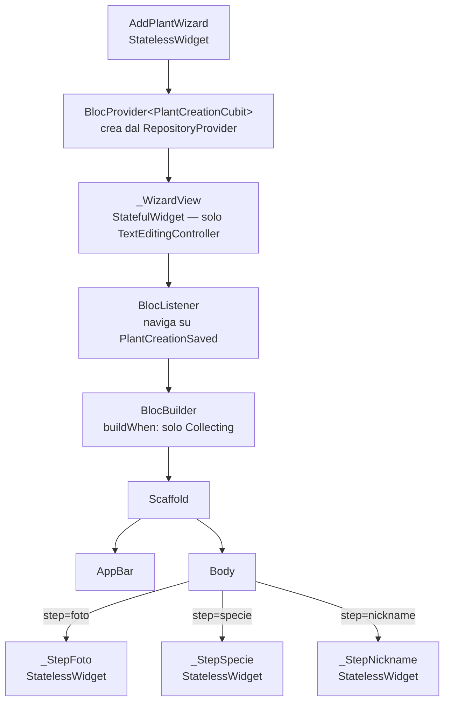

# Feature: Aggiunta Pianta (add_plant)

Wizard a 3 step che permette all'utente di creare una nuova pianta scegliendo foto, specie e nickname. Tutta la logica di business risiede in `PlantCreationCubit`; i widget sono stateless (salvo un thin wrapper per i `TextEditingController`).

**File:** `lib/features/add_plant/`

---

## Macchina a stati del Cubit

---

## Passi del wizard

---

## Sequence diagram — flusso completo

---

## Sequence diagram — chiusura senza salvataggio

---

## Modello delle classi

---

## Albero dei widget

---

## Regole di validazione del nickname

| Condizione | Comportamento |
|-----------|---------------|
| Vuoto / solo spazi | `null` → il repository genera il nickname di default |
| Lunghezza > 100 caratteri | `ArgumentError` |
| Contiene caratteri di controllo (U+0000–U+001F, U+007F) | `ArgumentError` |
| Valido non vuoto | Trimmed e usato così com'è |

I messaggi di errore non includono mai il valore fornito dall'utente.

---

## `canAdvance` per step

| Step | Condizione per `canAdvance = true` |
|------|------------------------------------|
| `foto` | `selectedPhoto != null` |
| `specie` | `species.trim().isNotEmpty` |
| `nickname` | sempre `true` |

---

## Copertura dei test

### `test/features/add_plant/plant_creation_cubit_test.dart` (14 test)

| Gruppo | Comportamenti |
|--------|---------------|
| Stato iniziale | Step = foto, nessuna foto, specie vuota |
| Step Foto | canAdvance false → true, advance no-op senza foto, advance avanza |
| Step Specie | canAdvance false → true, whitespace non conta, advance avanza |
| Step Nickname | canAdvance sempre true |
| save | Emette Saved, pianta nel repo, nickname di default, nickname trimmed, errori validazione |

### `test/features/add_plant/add_plant_wizard_test.dart` (11 test widget)

| Scenario | Comportamento |
|----------|---------------|
| Step Foto | Grid visibile, Avanti disabilitato, tap foto abilita e avanza |
| Step Specie | Avanti disabilitato, digitare abilita, tap dalla lista abilita |
| Step Nickname | Salva sempre abilitato |
| Chiusura | Nessuna pianta nel repo |
| Happy path | Pianta salvata con specie corretta |
