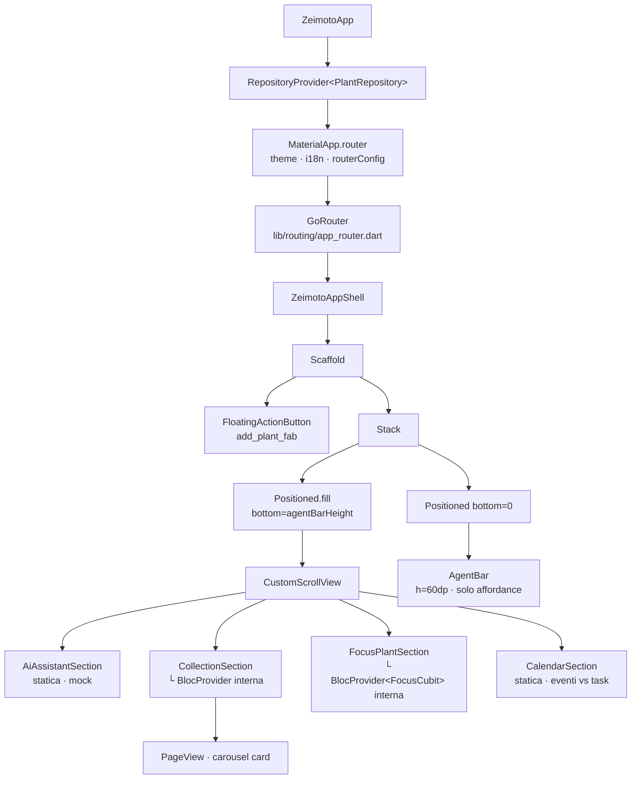

# App Shell

L'App Shell (`lib/app/zeimoto_app_shell.dart`) è il contenitore principale dell'applicazione. Fornisce lo scheletro visivo su cui tutte le sezioni MVP si andranno a montare.

---

## Albero dei widget



---

## Layout

```
┌────────────────────────────────────┐
│                                    │
│   Area scrollabile (sezioni MVP)   │
│   CustomScrollView                 │
│                                    │
│                              [+]   │  ← FAB (FloatingActionButton)
│                                    │
├────────────────────────────────────┤  ← agentBarHeight = 60dp
│   AgentBar  (pinned, affordance)   │
└────────────────────────────────────┘
```

Il `Scaffold` ha `backgroundColor: ZeimotoColors.washi` (`#F5F1E8`).

L'area scrollabile è posizionata con `Positioned.fill(bottom: 60)` per lasciare spazio fisso all'`AgentBar` in basso, senza sovrapposizioni.

**SafeArea constraint**: il `CustomScrollView` è wrappato in `SafeArea(bottom: false)` per proteggere il contenuto dal notch iOS e dalla status bar, mentre lascia lo spazio per l'`AgentBar` che è gestito separatamente.

---

## `ZeimotoAppShell`

`StatelessWidget`. Non detiene stato; le sezioni e i dati vengono iniettati dalle feature.

Al momento ospita:
- **Sezione Assistente AI** — `AiAssistantSection` (statica, contenuto mock).
- **Sezione Collezione** — `CollectionSection` (feature entry widget che crea il proprio `BlocProvider<CollectionCubit>` internamente); il callback `onTapPlant` chiama `PlantDetailRoute(plant).push(context)` (typed route via go_router).
- **Sezione Focus Pianta** — `FocusPlantSection` (feature entry widget che crea il proprio `BlocProvider<FocusCubit>` internamente); pesca casuale da `PlantRepository`; il callback `onTapPlant` chiama `PlantDetailRoute(plant).push(context)`.
- **Sezione Calendario** — `CalendarSection` (statica, dati mock; mostra eventi passati e task suggeriti in blocchi distinti).
- **FAB** — `FloatingActionButton` con `key: 'add_plant_fab'` posizionato sopra l'`AgentBar` (padding bottom = `agentBarHeight`); chiama `context.push(AppRoutes.addPlant)`.

La navigazione è **sempre delegata al layer `lib/routing/`** (costanti `AppRoutes` e wrapper typed). Nessuna schermata di feature viene importata direttamente (ADR-0001, ADR-0004).

---

## `AgentBar`

`StatelessWidget` pinned al fondo dello schermo.

| Proprietà | Valore |
|-----------|--------|
| Altezza | `60dp` (`ZeimotoSpacing.agentBarHeight`) |
| Sfondo | `ZeimotoColors.washi` |
| Bordo superiore | `charcoal @ 10%` |
| Ombra | `charcoal @ 5%`, blur 8dp, offset (0, −2) |
| Campo testo | Solo affordance visiva — `AbsorbPointer` impedisce focus e tastiera |
| CTA | **FAB sullo Scaffold** (non nella barra) — vedi `ZeimotoAppShell` |

Il testo segnaposto è localizzato (`l10n.agentBarHintText` = "Cosa vuoi fare oggi?"). Il campo non è interattivo in questo slice: l'intent detection è demandata a un futuro slice.

---

## Palette e costanti (`ZeimotoTheme`)

| Token | Hex | Uso |
|-------|-----|-----|
| `washi` | `#F5F1E8` | Background principale |
| `washiDeep` | `#EBE4D2` | Superfici secondarie |
| `sage` | `#8FA68E` | Colore secondario |
| `moss` | `#5C7361` | Colore primario |
| `charcoal` | `#2E2E2E` | Testo principale |
| `charcoalSoft` | `#6B6B6B` | Testo secondario |
| `cinnabar` | `#B94E3F` | Accento / errori |

---

## Copertura dei test

| Test file | Comportamenti verificati |
|-----------|--------------------------|
| `test/app/zeimoto_app_shell_test.dart` | Background washi, AgentBar visibile e pinned, area scrollabile, testo placeholder localizzato, FAB visibile, FAB apre wizard, chiusura wizard ritorna alla shell, campo non accetta input, collezione aggiornata dopo salvataggio |
| `test/features/collection/collection_cubit_test.dart` | Piante ordinate desc, empty state |
| `test/features/collection/collection_section_test.dart` | Carousel visibile, tap chiama callback, empty state widget, navigazione a PlantDetailPlaceholder |