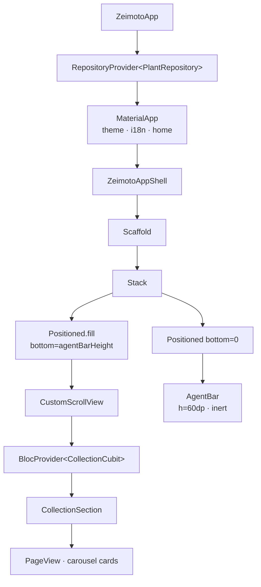

# App Shell

The App Shell (`lib/app/zeimoto_app_shell.dart`) is the main container of the application. It provides the visual skeleton on which all MVP sections will be mounted.

---

## Widget tree



---

## Layout

```
┌────────────────────────────────────┐
│                                    │
│   Scrollable area (MVP sections)   │
│   CustomScrollView                 │
│                                    │
│                                    │
│                                    │
├────────────────────────────────────┤  ← agentBarHeight = 60dp
│   AgentBar  (pinned, inert)        │
└────────────────────────────────────┘
```

The `Scaffold` has `backgroundColor: ZeimotoColors.washi` (`#F5F1E8`).

The scrollable area is positioned with `Positioned.fill(bottom: 60)` to leave a fixed 60dp slot for the `AgentBar` with no overlap.

**SafeArea constraint**: the `CustomScrollView` is wrapped in `SafeArea(bottom: false)` to protect content from iOS notch and status bar, while leaving space for the `AgentBar` which is managed separately.

---

## `ZeimotoAppShell`

`StatelessWidget`. Holds no state; sections and data are injected by feature Cubits.

Currently hosts:
- **Collection section** — `BlocProvider<CollectionCubit>` + `CollectionSection`; the `onTapPlant` callback pushes `PlantDetailPlaceholder` onto the navigator.

---

## `AgentBar`

`StatelessWidget` pinned to the bottom of the screen.

| Property | Value |
|----------|-------|
| Height | `60dp` (`ZeimotoSpacing.agentBarHeight`) |
| Background | `ZeimotoColors.washi` |
| Top border | `charcoal @ 10%` |
| Shadow | `charcoal @ 5%`, blur 8dp, offset (0, −2) |
| Current state | **Inert** — `AbsorbPointer` + `IgnorePointer` wrap the text field |

The placeholder text "Cosa vuoi fare oggi?" is hardcoded in this version; it will be internationalised and made interactive in issue A6.

---

## Palette and constants (`ZeimotoTheme`)

| Token | Hex | Usage |
|-------|-----|-------|
| `washi` | `#F5F1E8` | Main background |
| `washiDeep` | `#EBE4D2` | Secondary surfaces |
| `sage` | `#8FA68E` | Secondary colour |
| `moss` | `#5C7361` | Primary colour |
| `charcoal` | `#2E2E2E` | Main text |
| `charcoalSoft` | `#6B6B6B` | Secondary text |
| `cinnabar` | `#B94E3F` | Accent / errors |

---

## Test coverage

| Test file | Behaviours verified |
|-----------|---------------------|
| `test/app/zeimoto_app_shell_test.dart` | Washi background, AgentBar visible and pinned, scrollable area, placeholder text, AgentBar inert |
| `test/features/collection/collection_cubit_test.dart` | Plants sorted desc, empty state |
| `test/features/collection/collection_section_test.dart` | Carousel visible, tap calls callback, empty state widget, navigation to PlantDetailPlaceholder |
