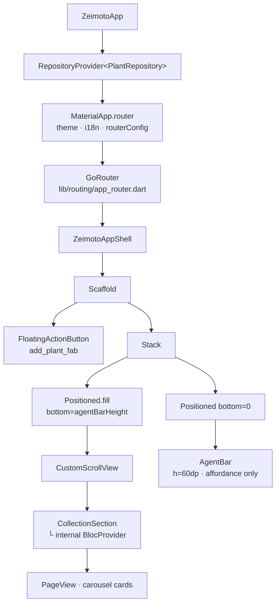

# App Shell

The App Shell (`lib/app/zeimoto_app_shell.dart`) is the main container of the application. It provides the visual skeleton on which all MVP sections will be mounted.

---

## Widget tree



---

## Layout

```
┌────────────────────────────────────┐
│                                    │
│   Scrollable area (MVP sections)   │
│   CustomScrollView                 │
│                                    │
│                              [+]   │  ← FAB (FloatingActionButton)
│                                    │
├────────────────────────────────────┤  ← agentBarHeight = 60dp
│   AgentBar  (pinned, affordance)   │
└────────────────────────────────────┘
```

The `Scaffold` has `backgroundColor: ZeimotoColors.washi` (`#F5F1E8`).

The scrollable area is positioned with `Positioned.fill(bottom: 60)` to leave a fixed 60dp slot for the `AgentBar` with no overlap.

**SafeArea constraint**: the `CustomScrollView` is wrapped in `SafeArea(bottom: false)` to protect content from iOS notch and status bar, while leaving space for the `AgentBar` which is managed separately.

---

## `ZeimotoAppShell`

`StatelessWidget`. Holds no state; sections and data are injected by feature Cubits.

Currently hosts:
- **Collection section** — `CollectionSection` (feature entry widget that creates its own `BlocProvider<CollectionCubit>` internally); the `onTapPlant` callback calls `context.push(AppRoutes.plantDetail, extra: plant)` via go_router.
- **FAB** — `FloatingActionButton` with `key: 'add_plant_fab'` positioned above the `AgentBar` (bottom padding = `agentBarHeight`); calls `context.push(AppRoutes.addPlant)`.

Navigation is **always delegated to `AppRoutes`** (`lib/routing/routes.dart`). No feature screens are imported directly (ADR-0001, ADR-0004).

---

## `AgentBar`

`StatelessWidget` pinned to the bottom of the screen.

| Property | Value |
|----------|-------|
| Height | `60dp` (`ZeimotoSpacing.agentBarHeight`) |
| Background | `ZeimotoColors.washi` |
| Top border | `charcoal @ 10%` |
| Shadow | `charcoal @ 5%`, blur 8dp, offset (0, −2) |
| Text field | Visual affordance only — `AbsorbPointer` prevents focus and keyboard |
| CTA | **FAB on the Scaffold** (not inside the bar) — see `ZeimotoAppShell` |

The placeholder text is localised (`l10n.agentBarHintText` = "Cosa vuoi fare oggi?"). The field is non-interactive in this slice; intent detection is deferred to a future slice.

---

## Palette and constants (`ZeimotoTheme`)

| Token | Hex | Usage |
|-------|-----|-------|
| `washi` | `#F5F1E8` | Main background |
| `washiDeep` | `#EBE4D2` | Secondary surfaces |
| `sage` | `#8FA68E` | Secondary colour |
| `moss` | `#5C7361` | Primary colour |
| `charcoal` | `#2E2E2E` | Main text |
| `charcoalSoft` | `#6B6B6B` | Secondary text |
| `cinnabar` | `#B94E3F` | Accent / errors |

---

## Test coverage

| Test file | Behaviours verified |
|-----------|---------------------|
| `test/app/zeimoto_app_shell_test.dart` | Washi background, AgentBar visible and pinned, scrollable area, localised placeholder text, FAB visible, FAB opens wizard, closing wizard returns to shell, field rejects input, collection updates after save |
| `test/features/collection/collection_cubit_test.dart` | Plants sorted desc, empty state |
| `test/features/collection/collection_section_test.dart` | Carousel visible, tap calls callback, empty state widget, navigation to PlantDetailPlaceholder |
