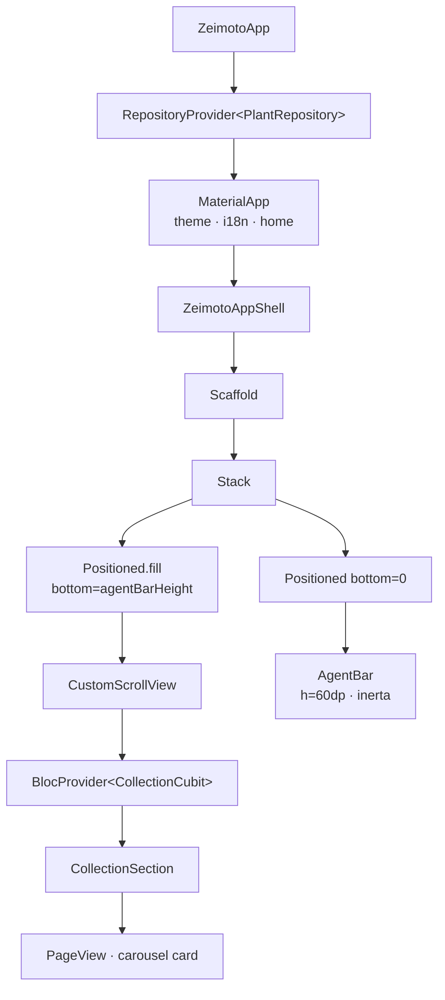

# App Shell

L'App Shell (`lib/app/zeimoto_app_shell.dart`) è il contenitore principale dell'applicazione. Fornisce lo scheletro visivo su cui tutte le sezioni MVP si andranno a montare.

---

## Albero dei widget



---

## Layout

```
┌────────────────────────────────────┐
│                                    │
│   Area scrollabile (sezioni MVP)   │
│   CustomScrollView                 │
│                                    │
│                                    │
│                                    │
├────────────────────────────────────┤  ← agentBarHeight = 60dp
│   AgentBar  (pinned, inerta)       │
└────────────────────────────────────┘
```

Il `Scaffold` ha `backgroundColor: ZeimotoColors.washi` (`#F5F1E8`).

L'area scrollabile è posizionata con `Positioned.fill(bottom: 60)` per lasciare spazio fisso all'`AgentBar` in basso, senza sovrapposizioni.

---

## `ZeimotoAppShell`

`StatelessWidget`. Non detiene stato; le sezioni e i dati vengono iniettati dalle feature.

Al momento ospita:
- **Sezione Collezione** — `BlocProvider<CollectionCubit>` + `CollectionSection`; il callback `onTapPlant` spinge `PlantDetailPlaceholder` sul navigator.

---

## `AgentBar`

`StatelessWidget` pinned al fondo dello schermo.

| Proprietà | Valore |
|-----------|--------|
| Altezza | `60dp` (`ZeimotoSpacing.agentBarHeight`) |
| Sfondo | `ZeimotoColors.washi` |
| Bordo superiore | `charcoal @ 10%` |
| Ombra | `charcoal @ 5%`, blur 8dp, offset (0, −2) |
| Stato attuale | **Inerta** — `AbsorbPointer` + `IgnorePointer` avvolgono il campo testo |

Il testo segnaposto "Cosa vuoi fare oggi?" è hardcoded in questa versione; verrà internazionalizzato e reso interattivo nella issue A6.

---

## Palette e costanti (`ZeimotoTheme`)

| Token | Hex | Uso |
|-------|-----|-----|
| `washi` | `#F5F1E8` | Background principale |
| `washiDeep` | `#EBE4D2` | Superfici secondarie |
| `sage` | `#8FA68E` | Colore secondario |
| `moss` | `#5C7361` | Colore primario |
| `charcoal` | `#2E2E2E` | Testo principale |
| `charcoalSoft` | `#6B6B6B` | Testo secondario |
| `cinnabar` | `#B94E3F` | Accento / errori |

---

## Copertura dei test

| Test file | Comportamenti verificati |
|-----------|--------------------------|
| `test/app/zeimoto_app_shell_test.dart` | Background washi, AgentBar visibile e pinned, area scrollabile, testo placeholder, AgentBar inerta || `test/features/collection/collection_cubit_test.dart` | Piante ordinate desc, empty state |
| `test/features/collection/collection_section_test.dart` | Carousel visibile, tap chiama callback, empty state widget, navigazione a PlantDetailPlaceholder |