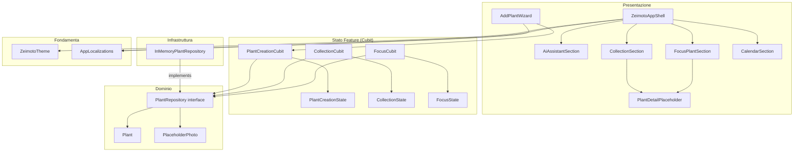
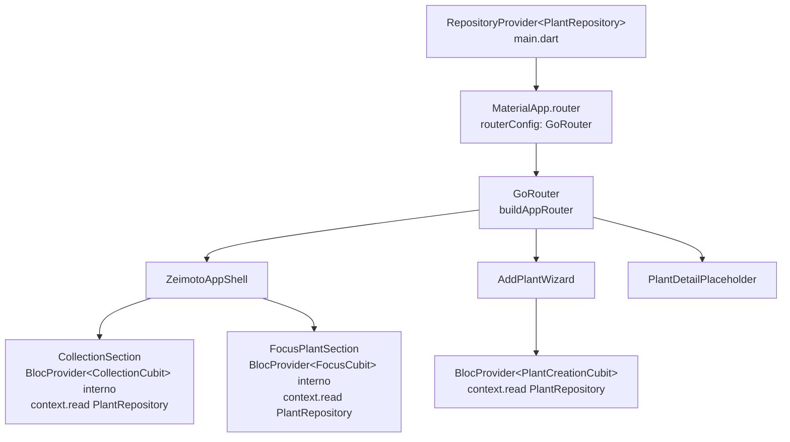

# Architettura Generale

Panoramica dell'architettura dell'applicazione Flutter Zeimoto al termine del MVP A1–A9 e A14.

---

## Struttura del progetto

```
flutter-app/lib/
├── main.dart                     # Entry point; RepositoryProvider radice + GoRouter
├── app/
│   └── zeimoto_app_shell.dart   # Shell principale + AgentBar + FAB
├── core/
│   └── design/
│       └── zeimoto_theme.dart   # Palette, spaziatura, ThemeData
├── domain/
│   └── plants.dart              # Tipi di dominio, interfaccia repository, impl. in-memory
├── features/
│   ├── add_plant/
│   │   ├── plant_creation_state.dart
│   │   ├── plant_creation_cubit.dart
│   │   └── add_plant_wizard.dart
│   ├── ai_assistant/
│   │   └── ai_assistant_section.dart
│   ├── calendar/
│   │   └── calendar_section.dart
│   ├── collection/
│   │   ├── collection_state.dart
│   │   ├── collection_cubit.dart
│   │   ├── collection_section.dart
│   │   └── plant_detail_placeholder.dart
│   └── focus/
│       ├── focus_state.dart
│       ├── focus_cubit.dart
│       └── focus_plant_section.dart
├── routing/
│   ├── routes.dart              # AppRoutes — costanti dei path (sorgente unica di verità)
│   ├── app_router.dart          # buildAppRouter() factory + re-export di routes.dart
│   └── plant_detail_route.dart  # typed route (GoRouteData) per /plant-detail
└── l10n/
    ├── app_it.arb               # Stringhe italiano (template)
    ├── app_en.arb               # Stringhe inglese
    └── app_localizations.dart   # Generato da flutter gen-l10n
```

---

## Livelli architetturali



---

## Iniezione delle dipendenze

`PlantRepository` è fornito una volta sola a livello di `main.dart` tramite `RepositoryProvider` (da `flutter_bloc`). Il `GoRouter` è creato da `buildAppRouter()` e passato a `MaterialApp.router`. Ogni feature legge il repository tramite `context.read<PlantRepository>()` nel `create` del proprio `BlocProvider`.



---

## Decisioni architetturali (ADR)

| ADR | Titolo |
|-----|--------|
| [0001](../adr/0001-feature-based-architecture.md) | Feature-based architecture sotto `lib/features/` |
| [0002](../adr/0002-flutter-bloc-state-management.md) | `flutter_bloc` come state-management seam |
| [0003](../adr/0003-business-logic-in-cubits.md) | Logica di business nei Cubit; nessun `*Flow` intermedio |
| [0004](../adr/0004-routing-go-router.md) | Routing centralizzato con go_router in `lib/routing/` |

---

## Convenzioni di test

| Layer | Strategia | File |
|-------|-----------|------|
| Cubit | Unit test puri, senza widget | `test/features/<nome>/*_cubit_test.dart` |
| Widget | Widget test con `GoRouter` locale + `RepositoryProvider.value` + fake/in-memory repo | `test/features/<nome>/*_test.dart` |
| App Shell | Widget test con `buildAppRouter()` reale + `InMemoryPlantRepository` | `test/app/*_test.dart` |
| Dominio | Unit test puri | `test/domain/*_test.dart` |
