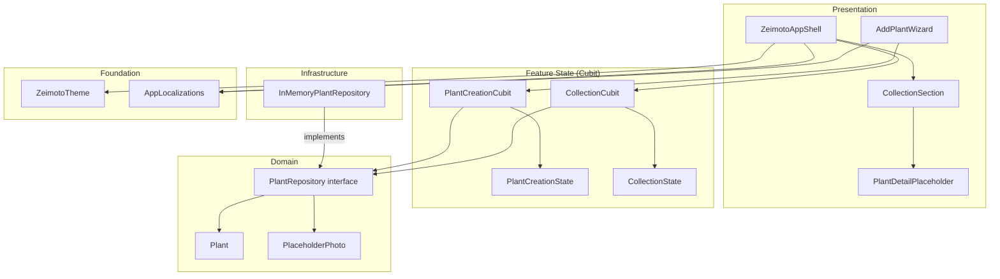
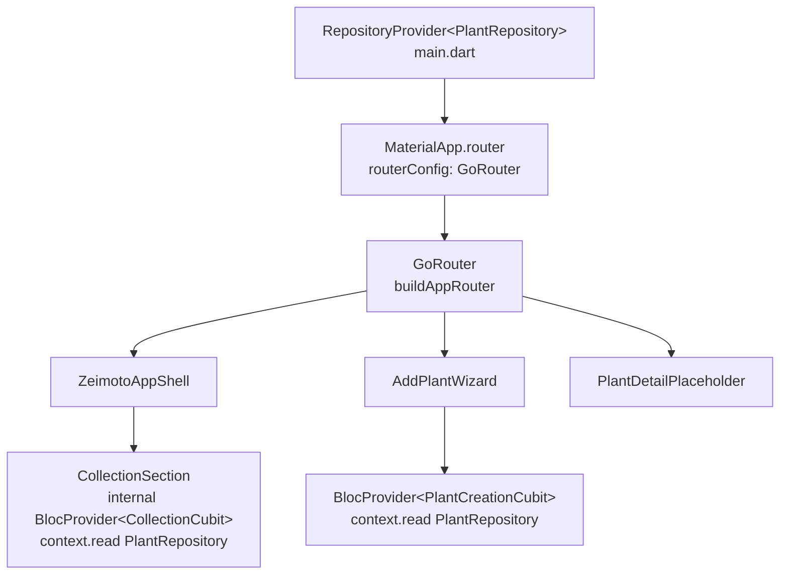

# General Architecture

Overview of the Zeimoto Flutter application architecture at the end of MVP A1–A5.

---

## Project structure

```
flutter-app/lib/
├── main.dart                     # Entry point; root RepositoryProvider + GoRouter
├── app/
│   └── zeimoto_app_shell.dart   # Main shell + AgentBar + FAB
├── core/
│   └── design/
│       └── zeimoto_theme.dart   # Palette, spacing, ThemeData
├── domain/
│   └── plants.dart              # Domain types, repository interface, in-memory impl.
├── features/
│   ├── add_plant/
│   │   ├── plant_creation_state.dart
│   │   ├── plant_creation_cubit.dart
│   │   └── add_plant_wizard.dart
│   └── collection/
│       ├── collection_state.dart
│       ├── collection_cubit.dart
│       ├── collection_section.dart
│       └── plant_detail_placeholder.dart
├── routing/
│   ├── routes.dart              # AppRoutes — path constants (single source of truth)
│   └── app_router.dart          # buildAppRouter() factory + re-export of routes.dart
└── l10n/
    ├── app_it.arb               # Italian strings (template)
    ├── app_en.arb               # English strings
    └── app_localizations.dart   # Generated by flutter gen-l10n
```

---

## Architectural layers



---

## Dependency injection

`PlantRepository` is constructed once at `main.dart` via `RepositoryProvider` (from `flutter_bloc`). The `GoRouter` is created by `buildAppRouter()` and passed to `MaterialApp.router`. Feature cubits read the repository via `context.read<PlantRepository>()` inside their `BlocProvider.create` callback.



---

## Architectural Decision Records

| ADR | Title |
|-----|-------|
| [0001](../adr/0001-feature-based-architecture.md) | Feature-based architecture under `lib/features/` |
| [0002](../adr/0002-flutter-bloc-state-management.md) | `flutter_bloc` as state-management seam |
| [0003](../adr/0003-business-logic-in-cubits.md) | Business logic lives in Cubits; no `*Flow` intermediaries |
| [0004](../adr/0004-routing-go-router.md) | Centralised routing with go_router in `lib/routing/` |

---

## Testing conventions

| Layer | Strategy | File location |
|-------|----------|---------------|
| Cubit | Pure unit tests, no widgets | `test/features/<name>/*_cubit_test.dart` |
| Widget | Widget tests with local `GoRouter` + `RepositoryProvider.value` + fake/in-memory repo | `test/features/<name>/*_test.dart` |
| App Shell | Widget tests with real `buildAppRouter()` + `InMemoryPlantRepository` | `test/app/*_test.dart` |
| Domain | Pure unit tests | `test/domain/*_test.dart` |
