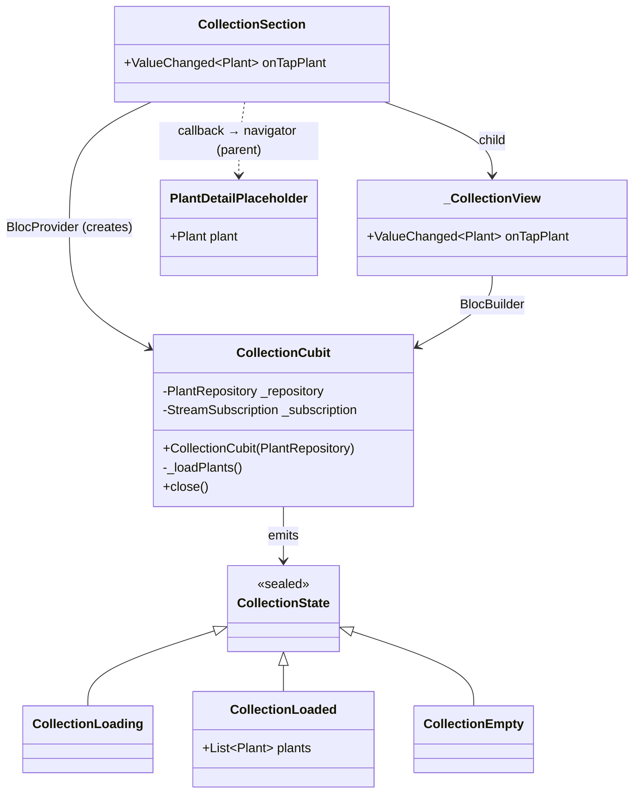

# Feature: Collection Section (collection)

The `collection` feature (`lib/features/collection/`) implements the home carousel section that shows the user's plants and navigates to a placeholder detail screen.

---

## Responsibilities

- Read plants from `PlantRepository` sorted by `createdAt` descending
- Display a horizontal carousel (`PageView`) of cards
- Handle empty state when the repository contains no plants
- Notify the parent via callback when a card is tapped

---

## Class diagram



---

## Data flow

```
RepositoryProvider<PlantRepository>  (main.dart)
         │
         ▼
CollectionSection — creates BlocProvider<CollectionCubit> internally
         │  context.read<PlantRepository>()
         ▼
CollectionCubit._loadPlants()  ← also triggered on PlantRepository.changes
         │
         ├── plants.isNotEmpty → emit CollectionLoaded(plants sorted desc)
         └── plants.isEmpty   → emit CollectionEmpty()
         │
         ▼
_CollectionView (BlocBuilder)
         │
         ├── CollectionLoaded → PageView of _PlantCard
         ├── CollectionEmpty  → empty state text (i18n)
         └── CollectionLoading → CircularProgressIndicator
         │
    tap on card
         │
         ▼
onTapPlant(plant) callback → ZeimotoAppShell → Navigator.push(PlantDetailPlaceholder)
```

---

## `CollectionSection`

**Feature entry widget** (ADR 0002): creates its own `BlocProvider<CollectionCubit>` internally by reading `PlantRepository` from the ambient `RepositoryProvider`. Delegates presentation to `_CollectionView`.

Receives an `onTapPlant(Plant)` callback. Does not handle navigation directly — the parent (`ZeimotoAppShell`) decides where to navigate. This makes the widget testable in isolation using `RepositoryProvider.value`.

---

## `CollectionCubit`

On construction:
1. Calls `_loadPlants()` to load plants immediately.
2. Subscribes to `PlantRepository.changes`; every event triggers `_loadPlants()` again.

`_loadPlants()` **explicitly** sorts plants by `createdAt` desc (does not rely on the repository implementation). In `close()` the subscription is cancelled.

## `PlantDetailPlaceholder`

Minimal screen that shows:
- Placeholder photo (gradient + emoji glyph)
- Nickname in `AppBar.title` (not duplicated in body)
- Species name (italic)
- Placeholder text for future details (i18n: `plantDetailComingSoon`)

Uses `SafeArea(top: false)` in the body since `AppBar` already handles the top inset.

Will be replaced by a rich detail screen in future issues.

---

## Empty state

When `PlantRepository.plants` is empty, the section shows a fixed text. A CTA to create the first plant can be added in the future.

---

## Live update

Live update is implemented via `PlantRepository.changes`: each time a plant is added to the repository, `CollectionCubit` receives a notification and reloads the list. The carousel updates without restarting the app.

---

## Test coverage

| Test file | Behaviours verified |
|-----------|---------------------|
| `test/features/collection/collection_cubit_test.dart` | Plants loaded and sorted by createdAt desc, empty state when repo empty |
| `test/features/collection/collection_section_test.dart` | Carousel visible, tap calls callback with correct plant, empty state, navigation to PlantDetailPlaceholder |
