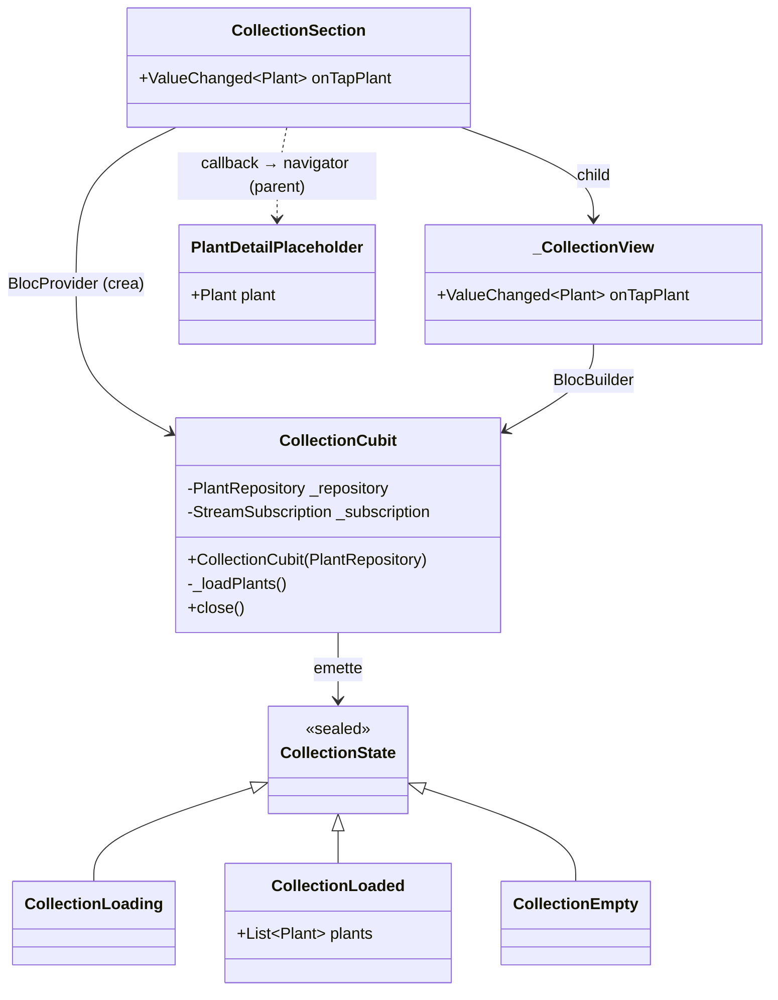

# Feature: Sezione Collezione (collection)

La feature `collection` (`lib/features/collection/`) implementa la sezione carosello della home che mostra le piante dell'utente e naviga al dettaglio placeholder.

---

## Responsabilità

- Leggere le piante da `PlantRepository` ordinate per `createdAt` decrescente
- Mostrare un carosello orizzontale (`PageView`) di card
- Gestire lo stato vuoto quando il repository non contiene piante
- Notificare il parent via callback al tap di una card

---

## Modello delle classi



---

## Flusso dati

```
RepositoryProvider<PlantRepository>  (main.dart)
         │
         ▼
CollectionSection — crea BlocProvider<CollectionCubit> internamente
         │  context.read<PlantRepository>()
         ▼
CollectionCubit._loadPlants()  ← chiamato anche su PlantRepository.changes
         │
         ├── plants.isNotEmpty → emit CollectionLoaded(plants ordinati desc)
         └── plants.isEmpty   → emit CollectionEmpty()
         │
         ▼
_CollectionView (BlocBuilder)
         │
         ├── CollectionLoaded → PageView di _PlantCard
         ├── CollectionEmpty  → stato vuoto testuale (i18n)
         └── CollectionLoading → CircularProgressIndicator
         │
    tap su card
         │
         ▼
onTapPlant(plant) callback → ZeimotoAppShell → Navigator.push(PlantDetailPlaceholder)
```

---

## `CollectionSection`

**Feature entry widget** (ADR 0002): crea il proprio `BlocProvider<CollectionCubit>` internamente leggendo `PlantRepository` dall'`RepositoryProvider` ambientale. Delega la presentazione a `_CollectionView`.

Riceve un callback `onTapPlant(Plant)`. Non gestisce la navigazione direttamente: è il parent (`ZeimotoAppShell`) che decide dove navigare. Questo rende il widget testabile in isolamento tramite `RepositoryProvider.value`.

---

## `CollectionCubit`

Al costruttore:
1. Chiama `_loadPlants()` per caricare le piante immediatamente.
2. Sottoscrive `PlantRepository.changes`; ogni evento richiama `_loadPlants()`.

`_loadPlants()` ordina **esplicitamente** le piante per `createdAt` desc (non si affida all'implementazione del repository). In `close()` la subscription viene cancellata.

## `PlantDetailPlaceholder`

Schermata minima che mostra:
- Foto placeholder (gradiente + emoji glyph)
- Nickname nell'`AppBar.title` (non duplicato nel body)
- Nome specie (in corsivo)
- Testo segnaposto per i dettagli futuri (i18n: `plantDetailComingSoon`)

Usa `SafeArea(top: false)` nel body poiché `AppBar` gestisce già l'inset superiore.

Verrà sostituita da una schermata ricca in issue successive.

---

## Stato vuoto

Quando `PlantRepository.plants` è vuoto, la sezione mostra un testo fisso. Una CTA per creare la prima pianta potrà essere aggiunta in futuro.

---

## Live update

Il live update è implementato tramite `PlantRepository.changes`: ogni volta che una pianta viene aggiunta al repository, il `CollectionCubit` riceve una notifica e ricarica la lista. Il carosello si aggiorna senza riavvio dell'app.

---

## Copertura dei test

| Test file | Comportamenti verificati |
|-----------|--------------------------|
| `test/features/collection/collection_cubit_test.dart` | Piante caricate e ordinate per createdAt desc, empty state quando repo vuoto |
| `test/features/collection/collection_section_test.dart` | Carosello visibile, tap card chiama callback con pianta corretta, stato vuoto, navigazione a PlantDetailPlaceholder |
