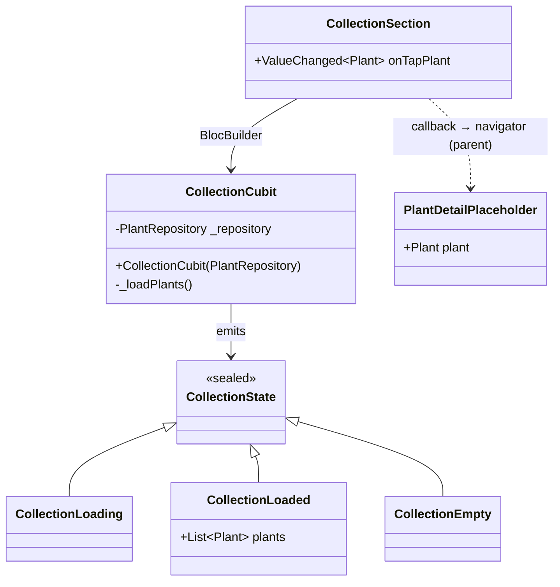

# Feature: Collection Section (collection)

The `collection` feature (`lib/features/collection/`) implements the home carousel section that shows the user's plants and navigates to a placeholder detail screen.

---

## Responsibilities

- Read plants from `PlantRepository` sorted by `createdAt` descending
- Display a horizontal carousel (`PageView`) of cards
- Handle empty state when the repository contains no plants
- Notify the parent via callback when a card is tapped

---

## Class diagram



---

## Data flow

```
RepositoryProvider<PlantRepository>  (main.dart)
         │
         ▼
BlocProvider<CollectionCubit>        (ZeimotoAppShell)
         │  context.read<PlantRepository>()
         ▼
CollectionCubit._loadPlants()
         │
         ├── plants.isNotEmpty → emit CollectionLoaded(plants)
         └── plants.isEmpty   → emit CollectionEmpty()
         │
         ▼
CollectionSection (BlocBuilder)
         │
         ├── CollectionLoaded → PageView of _PlantCard
         ├── CollectionEmpty  → empty state text
         └── CollectionLoading → CircularProgressIndicator
         │
    tap on card
         │
         ▼
onTapPlant(plant) callback → ZeimotoAppShell → Navigator.push(PlantDetailPlaceholder)
```

---

## `CollectionSection`

`StatelessWidget` that receives an `onTapPlant(Plant)` callback.

It does not handle navigation directly: the parent (`ZeimotoAppShell`) decides where to navigate. This makes the widget testable in isolation.

---

## `PlantDetailPlaceholder`

Minimal screen that shows:
- Placeholder photo (gradient + emoji glyph)
- Nickname (also in AppBar)
- Species name (italic)
- Placeholder text for future details

Will be replaced by a rich detail screen in future issues.

---

## Empty state

When `PlantRepository.plants` is empty, the section shows a fixed text. A CTA to create the first plant can be added in the future.

---

## Note: live update

Live update (a newly created plant appearing at the top of the carousel without restarting the app) is **deferred to A11**. In A5 the cubit populates once on construction; in A11 the parent will handle refresh after returning from the wizard.

---

## Test coverage

| Test file | Behaviours verified |
|-----------|---------------------|
| `test/features/collection/collection_cubit_test.dart` | Plants loaded sorted by createdAt desc, empty state when repo empty |
| `test/features/collection/collection_section_test.dart` | Carousel visible, tap calls callback with correct plant, empty state, navigation to PlantDetailPlaceholder |
