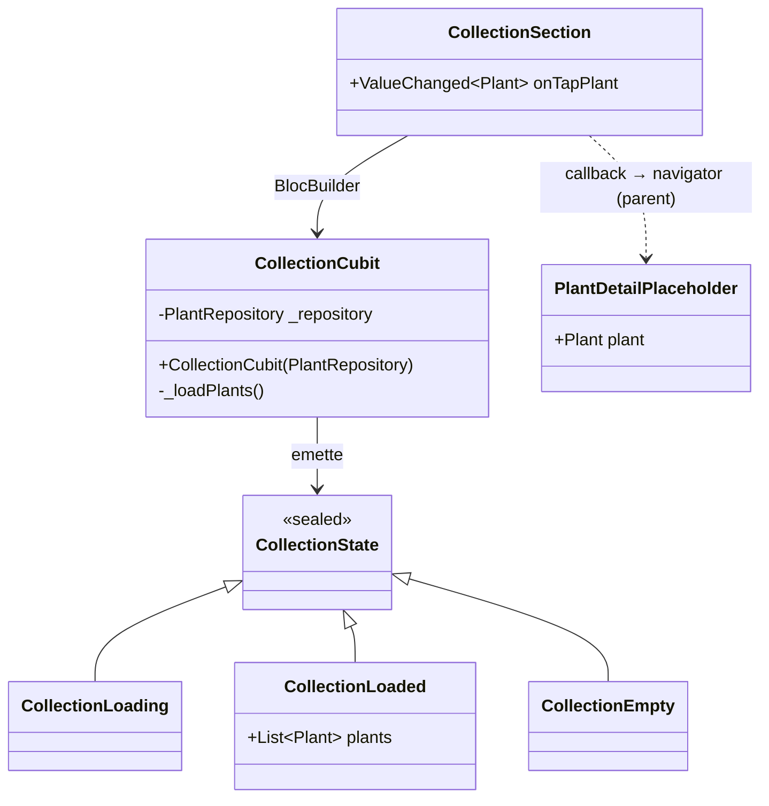

# Feature: Sezione Collezione (collection)

La feature `collection` (`lib/features/collection/`) implementa la sezione carosello della home che mostra le piante dell'utente e naviga al dettaglio placeholder.

---

## Responsabilità

- Leggere le piante da `PlantRepository` ordinate per `createdAt` decrescente
- Mostrare un carosello orizzontale (`PageView`) di card
- Gestire lo stato vuoto quando il repository non contiene piante
- Notificare il parent via callback al tap di una card

---

## Modello delle classi



---

## Flusso dati

```
RepositoryProvider<PlantRepository>  (main.dart)
         │
         ▼
BlocProvider<CollectionCubit>        (ZeimotoAppShell)
         │  context.read<PlantRepository>()
         ▼
CollectionCubit._loadPlants()
         │
         ├── plants.isNotEmpty → emit CollectionLoaded(plants)
         └── plants.isEmpty   → emit CollectionEmpty()
         │
         ▼
CollectionSection (BlocBuilder)
         │
         ├── CollectionLoaded → PageView di _PlantCard
         ├── CollectionEmpty  → stato vuoto testuale
         └── CollectionLoading → CircularProgressIndicator
         │
    tap su card
         │
         ▼
onTapPlant(plant) callback → ZeimotoAppShell → Navigator.push(PlantDetailPlaceholder)
```

---

## `CollectionSection`

`StatelessWidget` che riceve un callback `onTapPlant(Plant)`.

Non gestisce la navigazione direttamente: è il parent (`ZeimotoAppShell`) che decide dove navigare. Questo rende il widget testabile in isolamento.

---

## `PlantDetailPlaceholder`

Schermata minima che mostra:
- Foto placeholder (gradiente + emoji glyph)
- Nickname (anche nell'AppBar)
- Nome specie (in corsivo)
- Testo segnaposto per i dettagli futuri

Verrà sostituita da una schermata ricca in issue successive.

---

## Stato vuoto

Quando `PlantRepository.plants` è vuoto, la sezione mostra un testo fisso. Una CTA per creare la prima pianta potrà essere aggiunta in futuro.

---

## Nota: live update

Il live update (pianta appena creata compare in cima al carosello senza riavvio) è **rimandato ad A11**. In A5 il cubit si popola una sola volta al costruttore; in A11 il parent gestirà il refresh dopo il ritorno dal wizard.

---

## Copertura dei test

| Test file | Comportamenti verificati |
|-----------|--------------------------|
| `test/features/collection/collection_cubit_test.dart` | Piante caricate ordinate per createdAt desc, empty state quando repo vuoto |
| `test/features/collection/collection_section_test.dart` | Carosello visibile, tap card chiama callback con pianta corretta, stato vuoto, navigazione a PlantDetailPlaceholder |
