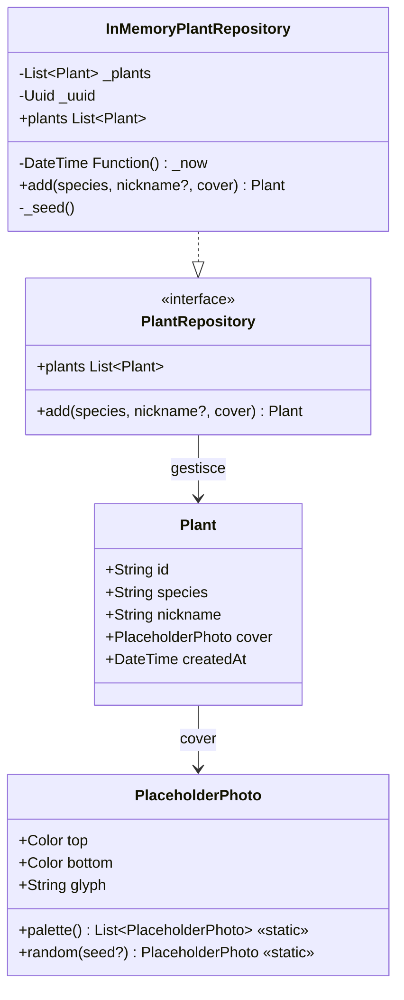

# Domain — Piante

Il layer di dominio (`lib/domain/plants.dart`) contiene tutti i tipi di dati condivisi, l'interfaccia del repository e l'implementazione in-memory usata nel MVP.

---

## Modello dati



---

## `Plant`

Oggetto valore immutabile che rappresenta una pianta nel sistema.

| Campo | Tipo | Descrizione |
|-------|------|-------------|
| `id` | `String` | UUID v4 generato dal repository |
| `species` | `String` | Nome scientifico della specie |
| `nickname` | `String` | Nome personalizzato o generato automaticamente |
| `cover` | `PlaceholderPhoto` | Foto placeholder selezionata |
| `createdAt` | `DateTime` | Timestamp di creazione |

---

## `PlaceholderPhoto`

Rappresenta una delle 6 foto placeholder della palette. Ogni foto è un gradiente verticale con un glifo emoji.

La palette contiene:

| Indice | Glifo | Colore top | Colore bottom |
|--------|-------|-----------|---------------|
| 0 | 🌲 | `#6E8B6A` | `#2F3F2C` |
| 1 | 🍁 | `#B2A57A` | `#5A4A2E` |
| 2 | 🌿 | `#9DB7C8` | `#3A5468` |
| 3 | 🌳 | `#C49A82` | `#5C382A` |
| 4 | 🎋 | `#A3C4A3` | `#3D5A3F` |
| 5 | 🌱 | `#D4B896` | `#6B4423` |

---

## `defaultNickname`

Funzione pura che genera il nickname di default quando l'utente non ne fornisce uno.

**Algoritmo:** prende l'ultima parola della specie, la converte in minuscolo e aggiunge un suffisso numerico a due cifre basato sul numero di piante esistenti.

**Esempi:**

| Specie | Conteggio esistenti | Risultato |
|--------|--------------------:|-----------|
| `Acer palmatum` | 2 | `palmatum_03` |
| `Ginkgo` | 0 | `ginkgo_01` |
| `Ficus retusa` | 4 | `retusa_05` |

---

## `PlantRepository` — interfaccia

```dart
abstract interface class PlantRepository {
  List<Plant> get plants;          // ordinata per createdAt decrescente

  /// Emette un evento void ogni volta che una pianta viene aggiunta.
  Stream<void> get changes;

  Plant add({
    required String species,
    String? nickname,              // null → genera defaultNickname
    required PlaceholderPhoto cover,
  });
}
```

---

## `InMemoryPlantRepository`

Implementazione in-memory usata nel MVP. Al costruttore, carica 5 piante di seed.

**Piante di seed:**

| Specie | Nickname |
|--------|---------|
| Juniperus chinensis | shohin del terrazzo |
| Acer palmatum | acero rosso |
| Pinus parviflora | pino delle nevi |
| Ficus retusa | ficus veloce |
| Ulmus parvifolia | olmo pigro |

Il getter `plants` restituisce sempre la lista ordinata per `createdAt` decrescente (piante più recenti prime).

Dopo ogni chiamata a `add()`, l'implementazione emette un evento su `changes` (tramite `StreamController.broadcast()`) per notificare i sottoscrittori (es. `CollectionCubit`) che la collezione è cambiata.

---

## `kSeedSpecies`

Lista di 10 specie predefinite offerte come suggerimento nel wizard di creazione:

```
Juniperus chinensis · Acer palmatum · Pinus parviflora · Ficus retusa
Ulmus parvifolia · Carpinus turczaninowii · Prunus mume · Zelkova serrata
Cryptomeria japonica · Punica granatum
```

---

## Copertura dei test

| Test file | Comportamenti verificati |
|-----------|--------------------------|
| `test/domain/plant_nickname_test.dart` | Generazione nickname: suffisso, single-word, nickname fornito, whitespace |
| `test/domain/in_memory_plant_repository_test.dart` | Ordine piante seed, pianta aggiunta appare in testa |
