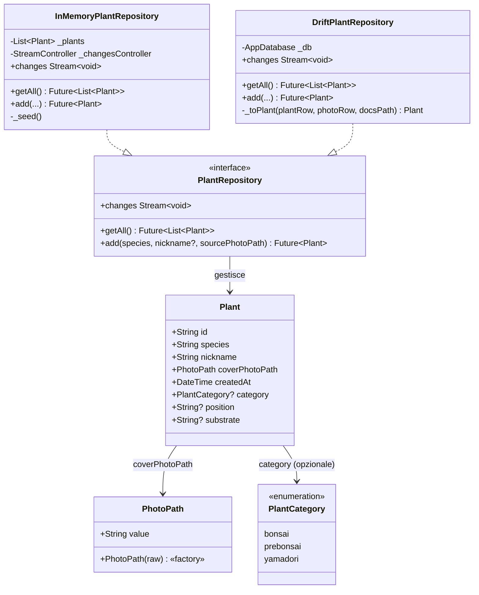

# Domain — Piante

Il layer di dominio (`lib/domain/plants.dart`) contiene tutti i tipi di dati condivisi, i value object, l'interfaccia del repository e l'implementazione in-memory usata nei test.

---

## Modello dati



---

## `Plant`

Oggetto valore immutabile che rappresenta una pianta nel sistema.

| Campo | Tipo | Descrizione |
|-------|------|-------------|
| `id` | `String` | UUID v4 generato dal repository |
| `species` | `String` | Nome scientifico della specie |
| `nickname` | `String` | Nome personalizzato o generato automaticamente |
| `coverPhotoPath` | `PhotoPath` | Percorso assoluto della foto di copertina sul filesystem locale |
| `createdAt` | `DateTime` | Timestamp di creazione |
| `category` | `PlantCategory?` | Categoria opzionale (bonsai, prebonsai, yamadori) |
| `position` | `String?` | Posizione della pianta (opzionale) |
| `substrate` | `String?` | Substrato usato (opzionale) |

---

## `PhotoPath`

Value object che incapsula e valida un percorso filesystem verso una foto di pianta.
Costruzione fallisce con `ArgumentError` se il percorso grezzo è vuoto o solo whitespace.

```dart
final class PhotoPath {
  factory PhotoPath(String raw); // lancia ArgumentError se vuoto
  final String value;
}
```

Usare `path.value` per interagire con API di sistema (`File`, `Image.file`, ecc.).

---

## `PlantCategory`

Enum che rappresenta la categoria di una pianta nella collezione. I valori sono in inglese per allineamento con il DB Drift, le chiavi ARB e i nomi enum.

| Valore | Descrizione |
|--------|-------------|
| `bonsai` | Bonsai finito |
| `prebonsai` | Materiale in sviluppo |
| `yamadori` | Raccolta da natura |

---

## `defaultNickname`

Funzione pura che genera il nickname di default quando l'utente non ne fornisce uno.

**Algoritmo:** prende l'ultima parola della specie, la converte in minuscolo e aggiunge un suffisso numerico a due cifre basato sul numero di piante esistenti.

**Esempi:**

| Specie | Conteggio esistenti | Risultato |
|--------|--------------------:|-----------|
| `Acer palmatum` | 2 | `palmatum_03` |
| `Ginkgo` | 0 | `ginkgo_01` |
| `Ficus retusa` | 4 | `retusa_05` |

---

## `PlantRepository` — interfaccia

```dart
abstract interface class PlantRepository {
  /// Restituisce tutte le piante ordinate per [Plant.createdAt] decrescente.
  Future<List<Plant>> getAll();

  /// Emette un evento void ogni volta che il set di piante cambia.
  Stream<void> get changes;

  /// Crea e persiste una nuova pianta.
  ///
  /// [sourcePhotoPath] è il percorso assoluto del file foto sorgente
  /// (es. file temporaneo da image_picker). Il repository copia il file
  /// nella directory documenti dell'app e salva il percorso relativo nel DB.
  ///
  /// [nickname] null o vuoto → generato automaticamente da [defaultNickname].
  Future<Plant> add({
    required String species,
    String? nickname,
    required String sourcePhotoPath,
  });
}
```

L'interfaccia è **completamente asincrona** (Future + Stream): il vecchio `PlantStore` sincrono + `ChangeNotifier` è stato rimosso. La reattività della UI avviene tramite i Cubit che ascoltano `changes` e ri-caricano via `getAll()` — scelta C (Bloc/Cubit) secondo la decisione documentata in [ADR 0005](../adr/0005-plant-repository-drift-contract.md).

---

## `InMemoryPlantRepository`

Implementazione in-memory usata nei test e nello sviluppo locale. Al costruttore, carica 5 piante di seed con percorsi sintetici (`photos/seed_<n>.jpg`) — nessun file reale viene creato. Sicura da usare in unit test e widget test che non verificano il rendering foto.

**Piante di seed:**

| Specie | Nickname |
|--------|---------|
| Juniperus chinensis | shohin del terrazzo |
| Acer palmatum | acero rosso |
| Pinus parviflora | pino delle nevi |
| Ficus retusa | ficus veloce |
| Ulmus parvifolia | olmo pigro |

---

## `DriftPlantRepository`

Implementazione backed da SQLite tramite Drift. Vedi [ADR 0005](../adr/0005-plant-repository-drift-contract.md) per il contratto completo, la strategia di test e le decisioni architetturali.

Punti chiave:
- Riceve `AppDatabase` via costruttore per piena testabilità (`NativeDatabase.memory()`).
- `add()` esegue la copia del file foto e gli INSERT in una singola transazione.
- `changes` è un `Stream<void>` derivato da `_db.select(_db.plants).watch()`.
- Mappa `PlantData` (Drift) → `Plant` (dominio) nel metodo privato `_toPlant()`.

---

## `kSeedSpecies`

Lista di 10 specie predefinite offerte come suggerimento nel wizard di creazione:

```
Juniperus chinensis · Acer palmatum · Pinus parviflora · Ficus retusa
Ulmus parvifolia · Carpinus turczaninowii · Prunus mume · Zelkova serrata
Cryptomeria japonica · Punica granatum
```

---

## Copertura dei test

| Test file | Comportamenti verificati |
|-----------|--------------------------|
| `test/domain/plant_nickname_test.dart` | Generazione nickname: suffisso, single-word, nickname fornito, whitespace |
| `test/domain/in_memory_plant_repository_test.dart` | Ordine piante seed, pianta aggiunta appare in testa |
| `test/data/repositories/drift_plant_repository_test.dart` | add/getAll/changes/copia file, con `NativeDatabase.memory()` |

