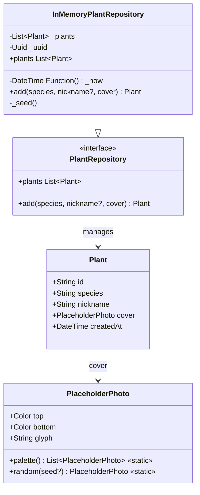

# Domain — Plants

The domain layer (`lib/domain/plants.dart`) contains all shared data types, the repository interface, and the in-memory implementation used in the MVP.

---

## Data model



---

## `Plant`

Immutable value object representing a plant in the system.

| Field | Type | Description |
|-------|------|-------------|
| `id` | `String` | UUID v4 generated by the repository |
| `species` | `String` | Scientific species name |
| `nickname` | `String` | User-supplied or auto-generated name |
| `cover` | `PlaceholderPhoto` | Selected placeholder photo |
| `createdAt` | `DateTime` | Creation timestamp |

---

## `PlaceholderPhoto`

Represents one of the 6 palette placeholder photos. Each photo is a vertical gradient with an emoji glyph.

Palette:

| Index | Glyph | Top colour | Bottom colour |
|-------|-------|-----------|---------------|
| 0 | 🌲 | `#6E8B6A` | `#2F3F2C` |
| 1 | 🍁 | `#B2A57A` | `#5A4A2E` |
| 2 | 🌿 | `#9DB7C8` | `#3A5468` |
| 3 | 🌳 | `#C49A82` | `#5C382A` |
| 4 | 🎋 | `#A3C4A3` | `#3D5A3F` |
| 5 | 🌱 | `#D4B896` | `#6B4423` |

---

## `defaultNickname`

Pure function that generates the default nickname when the user leaves the field blank.

**Algorithm:** takes the last word of the species name, lower-cases it, and appends a zero-padded two-digit suffix based on the existing plant count.

**Examples:**

| Species | Existing count | Result |
|---------|---------------:|--------|
| `Acer palmatum` | 2 | `palmatum_03` |
| `Ginkgo` | 0 | `ginkgo_01` |
| `Ficus retusa` | 4 | `retusa_05` |

---

## `PlantRepository` — interface

```dart
abstract interface class PlantRepository {
  List<Plant> get plants;          // sorted by createdAt descending
  Plant add({
    required String species,
    String? nickname,              // null → generates defaultNickname
    required PlaceholderPhoto cover,
  });
}
```

---

## `InMemoryPlantRepository`

In-memory implementation used in the MVP. On construction it seeds 5 plants.

**Seed plants:**

| Species | Nickname |
|---------|---------|
| Juniperus chinensis | shohin del terrazzo |
| Acer palmatum | acero rosso |
| Pinus parviflora | pino delle nevi |
| Ficus retusa | ficus veloce |
| Ulmus parvifolia | olmo pigro |

The `plants` getter always returns the list sorted by `createdAt` descending (newest first).

---

## `kSeedSpecies`

List of 10 species offered as suggestions in the creation wizard:

```
Juniperus chinensis · Acer palmatum · Pinus parviflora · Ficus retusa
Ulmus parvifolia · Carpinus turczaninowii · Prunus mume · Zelkova serrata
Cryptomeria japonica · Punica granatum
```

---

## Test coverage

| Test file | Behaviours verified |
|-----------|---------------------|
| `test/domain/plant_nickname_test.dart` | Nickname generation: suffix, single-word species, provided nickname, whitespace |
| `test/domain/in_memory_plant_repository_test.dart` | Seed plant order, added plant appears first |
